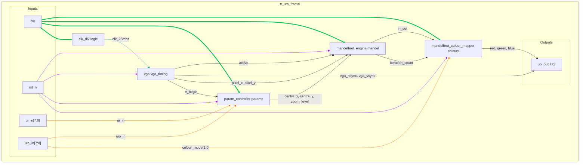

## How it Works

This project implements a Mandelbrot set Fractal Generator with VGA output capability. The system generates real-time Mandelbrot set visualizations by computing the mathematical iteration for each pixel coordinate.

The user is able to change the view of the set with the IO pins.

1.  **Clocking**: The top module `tt_um_fractal` takes a 50MHz system clock and uses a clock divider to produce a 25MHz pixel clock required for the VGA signal generation module.

2.  **VGA Timing**: The `vga` module uses the 25MHz clock to generate standard VGA synchronization signals (`hsync`, `vsync`) and keeps track of the current pixel coordinates being drawn (`hpos`, `vpos`). It also outputs an `active` signal, which is high only when the beam is within the visible 640x480 display area. This is used to synchronize the mandelbrot pixel calculation.

3.  **User Input & Parameter Control**: The `param_controller` module reads user inputs for panning and zooming (`ui_in`). To prevent visual glitches like tearing, it only updates the fractal's parameters (centre coordinates and zoom level) at the beginning of a new frame, signalled by `v_begin` from the `vga` module. The panning speed is dynamically adjusted based on the zoom level.

4.  **Fractal Calculation**: The escape‑time algorithm computes iterates of \( z_{n+1} = z_n^2 + c \) using fixed‑point arithmetic.

#### Escape‑time algorithm (Explanation)

- Pixel -> complex mapping (top‑level signals):
  - Compute offsets from the screen centre: `dx = pixel_x − 320`, `dy = pixel_y − 240`.
  - Compute scale factor by shifts: `scale_factor = (1 << FRAC_BITS) >> zoom_shift`.
  - Map to complex plane in fixed‑point: `c_real = centre_x + ((dx * scale_factor) >> FRAC_BITS)`, similarly for `c_imag`.

- Iteration loop (Q‑format, FRAC_BITS = n):

  ```text
  z_real = 0; z_imag = 0
  for i in 0..max_iter_limit:
      // escape test: |z|^2 > 4.0 → (zr*zr >> n) + (zi*zi >> n) > (4 << n)
      if ((zr*zr >> n) + (zi*zi >> n)) > (4 << n):
          return i
      // z^2 + c with fixed‑point rescale back by >> n
      zr2 = (zr*zr >> n) - (zi*zi >> n)
      zi2 = ((zr*zi) << 1) >> n
      z_real = zr2 + c_real
      z_imag = zi2 + c_imag
  return max_iter_limit
  ```

- Fixed‑point notes (Qm.n):
  - Stored integer `x` encodes real `x / 2^n`; top‑level uses `FRAC_BITS = 6` for 1×2 timing/area.
  - After multiplies, shift right by `n` to return to the working Q format.
  - Constants: `4.0 = (4 << n)`; for `n = 6`, `4.0 = 256`.

- Iteration cap and image quality:
  - The design caps iterations at the top level (`MAX_ITERATIONS = 16`) to balance detail and throughput.
  - Larger caps give crisper boundaries but increase compute time. The top uses tile replication (compute once per H×V tile, then replicate) with stride presets on `uio_in[3:2]` to keep full 640×480 VGA without a frame buffer.

5.  **Colour Mapping**: The resulting `iteration_count` from the engine is passed to the `mandelbrot_colour_mapper`. This module translates the numerical iteration count into a 6-bit RGB colour value. It supports two colour schemes (greyscale and fire), selected via `uio_in[0]` (only bit 0 is used). Points determined to be inside the set are coloured black for high contrast.

6.  **Top-Level Integration**: The `tt_um_fractal` module integrates all these components. It connects the user inputs to the parameter controller, pipes the fractal parameters and pixel coordinates to the calculation engine, sends the iteration count to the colour mapper, and finally drives the VGA output pins with the resulting colour data and sync signals. To meet 1×2 timing/area, the top replicates the computed pixel over an \(H\times V\) tile; the tile size is selectable.

### Architecture Diagram



---

### IO Table: `vga`

| **Name**            | **Verilog** | **Description**                                             | **I/O** | **Width** | **Type**    |
| :------------------ | :---------- | :---------------------------------------------------------- | :-----: | :-------: | :---------- |
| Clock               | `clk`       | 25MHz pixel clock signal. dividided from 50MHz system clock |    I    |     1     | Rising Edge |
| Reset               | `rst_n`     | Asynchronous active-low reset                               |    I    |     1     | Active Low  |
| Clock Enable        | `clk_en`    | Enables counter updates                                     |    I    |     1     | Active High |
| Active Display      | `active`    | High when drawing visible pixels                            |    O    |     1     | N/A         |
| Horizontal Sync     | `hsync`     | Horizontal synchronization pulse                            |    O    |     1     | N/A         |
| Vertical Sync       | `vsync`     | Vertical synchronization pulse                              |    O    |     1     | N/A         |
| Frame Start         | `v_begin`   | Single-cycle pulse at the start of a new frame              |    O    |     1     | N/A         |
| Horizontal Position | `hpos`      | Current horizontal pixel coordinate (X)                     |    O    |    10     | N/A         |
| Vertical Position   | `vpos`      | Current vertical line coordinate (Y)                        |    O    |    10     | N/A         |

#### Notes
* The module is parameterized for a standard **640x480 @ 60Hz** VGA resolution, but can be run at lower resolutions for fast tests.
* The `hpos` and `vpos` counters increment on each enabled clock edge, scanning the screen from left to right, top to bottom.
* The `active` signal should be used by the mandelbrot engine to know which pixels are in view of the screen.

---

### IO Table: `param_controller`

| **Name**       | **Verilog**      | **Description**                                | **I/O** | **Width** | **Trigger** |
| :------------- | :--------------- | :--------------------------------------------- | :-----: | :-------: | :---------- |
| Clock          | `clk`            | 50MHz system clock                             |    I    |     1     | Rising Edge |
| Reset          | `rst_n`          | Asynchronous active-low reset                  |    I    |     1     | Active Low  |
| Frame Start    | `v_begin`        | Pulse indicating the start of a new frame      |    I    |     1     | Active High |
| User Input     | `ui_in`          | 8-bit input for control (pan, zoom, reset)     |    I    |     8     | N/A         |
| User IO Input  | `uio_in`         | Bidirectional IO pins used as inputs           |    I    |     8     | N/A         |
| Centre X       | `centre_x`       | X-coordinate of the view centre (Q4.12 format) |    O    |    16     | N/A         |
| Centre Y       | `centre_y`       | Y-coordinate of the view centre (Q4.12 format) |    O    |    16     | N/A         |
| Zoom Level     | `zoom_level`     | Current zoom magnification level               |    O    |     8     | N/A         |

#### Notes
* This module translates switch/button presses into changes in the fractal's viewport.
* Coordinates are handled as 16-bit fixed point integer in Q4.12.
* Panning speed scales with zoom: The `pan_step` is reduced at higher zoom levels, allowing for finer control when exploring detailed areas.
* Updates to the output parameters (`centre_x`, `centre_y`, etc.) are registered and only occur when `v_begin` is high, ensuring the entire frame is rendered with the same parameters.

---

### IO Table: `mandelbrot_colour_mapper`

| **Name**        | **Verilog**       | **Description**                                | **I/O** | **Width** | **Trigger** |
| :-------------- | :---------------- | :--------------------------------------------- | :-----: | :-------: | :---------- |
| Clock           | `clk`             | System clock                                   |    I    |     1     | Rising Edge |
| Reset           | `rst_n`           | Asynchronous active-low reset                  |    I    |     1     | Active Low  |
| Iteration Count | `iteration_count` | Escape-time value from the fractal engine      |    I    |     6     | N/A         |
| Colour Mode      | `colour_mode`     | Selects colour scheme (bit 0 used)             |    I    |     2     | N/A         |
| In Set Flag     | `in_set`          | High if the point is inside the Mandelbrot set |    I    |     1     | N/A         |
| Red Channel     | `red`             | 2-bit red colour component                     |    O    |     2     | N/A         |
| Green Channel   | `green`           | 2-bit green colour component                   |    O    |     2     | N/A         |
| Blue Channel    | `blue`            | 2-bit blue colour component                    |    O    |     2     | N/A         |

#### Notes
* This maps a 6-bit iteration value to rgb and registers outputs for timing.
* If `in_set` is high, output is black (`6'b000000`) regardless of mode.
* Available `colour_mode` options (bit 0 only):
    * `0`: greyscale.
    * `1`: fire (red/orange/yellow/white).

---

### IO Table: `tt_um_fractal`

| **Name**       | **Verilog** | **Description**                       | **I/O** | **Width** | **Trigger** |
| :------------- | :---------- | :------------------------------------ | :-----: | :-------: | :---------- |
| User Input     | `ui_in`     | 8 dedicated input pins                |    I    |     8     | N/A         |
| User Output    | `uo_out`    | 8 dedicated output pins               |    O    |     8     | N/A         |
| User IO Input  | `uio_in`    | 8 bidirectional IO pins (input path)  |    I    |     8     | N/A         |
| User IO Output | `uio_out`   | 8 bidirectional IO pins (output path) |    O    |     8     | N/A         |
| User IO Enable | `uio_oe`    | 8 IO output enable signals            |    O    |     8     | N/A         |
| Chip Enable    | `ena`       | Always high when design is powered    |    I    |     1     | Active High |
| Clock          | `clk`       | 50MHz system clock                    |    I    |     1     | Rising Edge |
| Reset          | `rst_n`     | Active-low reset                      |    I    |     1     | Active Low  |

#### `tt_um_fractal` Notes
* This module is the top-level wrapper for the TinyTapeout ASIC platform.
* **Pin Mapping (`ui_in`)**:
    * `ui_in[0]`: Zoom In
    * `ui_in[1]`: Zoom Out
    * `ui_in[2]`: Pan Left
    * `ui_in[3]`: Pan Right
    * `ui_in[4]`: Pan Up
    * `ui_in[5]`: Pan Down
    * `ui_in[6]`: Reset View
    * `ui_in[7]`: Enable fractal rendering
* **Pin Mapping (`uio_in`)**:
    * `uio_in[0]`: colour mode (0=greyscale, 1=fire)
    * `uio_in[3:2]`: tile stride preset (image sharpness)
* **Pin Mapping (`uo_out`)**:
    * `uo_out[7]`: HSync
    * `uo_out[6]`: Blue[0]
    * `uo_out[5]`: Green[0]
    * `uo_out[4]`: Red[0]
    * `uo_out[3]`: VSync
    * `uo_out[2]`: Blue[1]
    * `uo_out[1]`: Green[1]
    * `uo_out[0]`: Red[1]
* The `uio_oe` bus is tied to `0`, configuring all `uio` pins as inputs.

---

### How to Test

This section on testing in hardware. For unit tests see [test.md](./test.md)

#### Hardware Setup

**Required Components:**
* VGA monitor
* TinyTapeout VGA PMOD
* 11 buttons or switches for `ui_in[7:0]`, `uio_in[1:0]`, and `rst_n`.
* A 50 MHz clock source.

#### Test Procedure

1.  **Initial Display and Enable**
    * Connect all required hardware and power on the VGA display, then the rest of the test setup.
    * Press `rst_n` button to initialize the design.
    * Set the `ui_in[7]` switch (Enable) to '1' (high). All other `ui_in` switches should be '0'.
    * **Expected Result:** The default view of the Mandelbrot set should appear on the VGA monitor.

2.  **Pan/Zoom**
    * **Zoom In:** Toggle the `ui_in[0]` switch high, then low. The view should zoom in.
    * **Zoom Out:** Toggle the `ui_in[1]` switch high, then low. The view should zoom out.
    * **Pan:** Toggle switches `ui_in[2]` (Left), `ui_in[3]` (Right), `ui_in[4]` (Up), and `ui_in[5]` (Down) one at a time. The view should pan.
    * **Reset View:** After zooming and panning, toggle the `ui_in[6]` switch high, then low. The view should return to the initial default state seen at power-up.

3.  **Colour Mode**
    * Toggle `uio_in[0]` to change the colour scheme.
        * `0`: greyscale.
        * `1`: fire.

4.  **Tile Stride Preset (Sharpness vs speed)**
    * Set `uio_in[3:2]` to select tile size (H×V):
        * `00`: 64×16 (fastest, blockiest)
        * `01`: 32×8 (good balance)
        * `10`: 32×16
        * `11`: 16×8 (sharpest of presets)

#### Control Signal Format

The design is controlled via simple high/low logic levels. Except for `rst_n` which is asynchronous and active low, all other inputs will only take effect at the start of a new frame to prevent screen tearing and are active high. So for example holding the zoom input high for multiple frames will cause more zoom at the begining of each new frame.

#### External Hardware

* VGA monitor
* TinyTapeout VGA PMOD
* 11 buttons or switches for `ui_in[7:0]`, `uio_in[1:0]`, and `rst_n`.
* A 50 MHz clock source.

#### Pin Connections (more detail in pin sections above)

* `ui_in[0]`: Zoom In control
* `ui_in[1]`: Zoom Out control
* `ui_in[2]`: Pan Left control
* `ui_in[3]`: Pan Right control
* `ui_in[4]`: Pan Up control
* `ui_in[5]`: Pan Down control
* `ui_in[6]`: Reset View control
* `ui_in[7]`: Master Enable (1 = On, 0 = Off)
* `uo_out[7:0]`: VGA output signals (connect to VGA PMOD/breakout).
* `uio_in[1:0]`: Colour Mode select.
* `rst_n`: Active-low reset button.
* `clk`: 50 MHz system clock input.

---

### Test plan (single source of truth)

- Verification uses cocotb exclusively [[memory:2434769]]. Unit and integration tests live under `test/`.
- VGA timing: reset, clk_en gating, two-frame scan, statistical counts at 640x480 and reduced modes.
- Engine: DUT iteration counts compared to a Python Q3.8 fixed-point model with documented tolerances for quantization; boundary and arithmetic edge cases included; handshake/latency bounds test included.
- Top-level: RGB range checks, colour-mode switching via `uio_in[1:0]`, enable/disable behavior.
- PNG capture: one full 640x480 frame saved to `test/out.png` with 307,200 pixels captured.

How to run (from `test/`): `make tb-engine`, `make tb-vga`, `make tb-mandelbrot`, `make tb-png`.

---

### Evidence of working RTL

- Engine: 15/15 tests PASS.
- VGA: 5/5 tests PASS.
- Top-level smoke: PASS. PNG capture: PASS (307,200 pixels).

Artifacts: `test/out.png`, VCDs in `test/`, logs in cocotb output.

---

### Synthesis area (Sky130 HD, TT)

Yosys + Sky130 liberty synthesis (`yosys -s sky130_synthesis.ys`) reports approximate cell areas:

- `mandelbrot_engine` ≈ 14,770
- `vga` ≈ 958
- `param_controller` ≈ 2,263
- `mandelbrot_colour_mapper` ≈ 229
- Top `tt_um_fractal` ≈ 18,479

This is consistent with fitting in a 1×2 TinyTapeout tile.

---

### Static Timing (OpenSTA)

- OpenSTA TT/SS/FF checks show no violations in the included report (`docs/sta_results.txt`), with representative setup/hold slack MET at 50 MHz.
- The flow/script baseline aligns with common Sky130 OpenSTA scripts (e.g., Revenantx86/verilog_sta). Use TinyTapeout/OpenLane-generated STA where available; link GH Actions artifacts in this repo’s runs page.

---

### Contributions (summary)

- VGA timing and cocotb VGA suite; PNG harness; synth scripts.
- Engine integration, param controller, colour mapper; test plan and docs.
- TinyTapeout scaffolding and harness patterns.

Evidence: `git shortlog -sn` in repo root.

---

### Submission

Create a submission archive containing `info.yaml`, `src/`, `docs/`, `README.md`, and `LICENSE` (e.g., using your VCS or a zip of the repository root).
