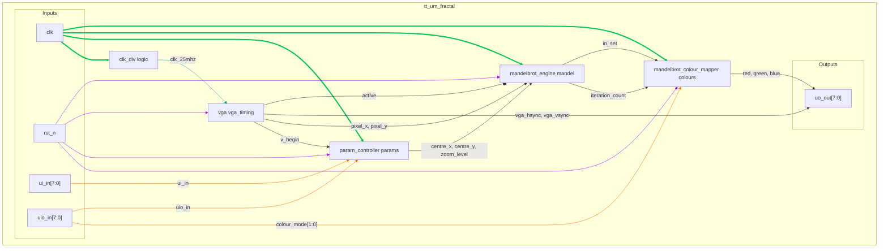

## How it Works

This project implements a Mandelbrot set Fractal Generator with VGA output capability. The system generates real-time Mandelbrot set visualizations by computing the mathematical iteration for each pixel coordinate.

The user is able to change the view of the set with the IO pins.

1.  **Clocking**: The top module `tt_um_fractal` takes a 50MHz system clock and uses a clock divider to produce a 25MHz pixel clock required for the VGA signal generation module.

2.  **VGA Timing**: The `vga` module uses the 25MHz clock to generate standard VGA synchronization signals (`hsync`, `vsync`) and keeps track of the current pixel coordinates being drawn (`hpos`, `vpos`). It also outputs an `active` signal, which is high only when the beam is within the visible 640x480 display area. This is used to synchronize the mandelbrot pixel calculation.

3.  **User Input & Parameter Control**: The `param_controller` module reads user inputs for panning and zooming (`ui_in`). To prevent visual glitches like tearing, it only updates the fractal's parameters (center coordinates and zoom level) at the beginning of a new frame, signaled by `v_begin` from the `vga` module. The panning speed is dynamically adjusted based on the zoom level.

4.  **Fractal Calculation**: W $z_{n+1} = z_n^2 + c$

5.  **Color Mapping**: The resulting `iteration_count` from the engine is passed to the `mandelbrot_colour_mapper`. This module translates the numerical iteration count into a 6-bit RGB color value. It supports four distinct color schemes, which can be selected via the `uio_in` pins. Points determined to be inside the set are colored black for high contrast.

6.  **Top-Level Integration**: The `tt_um_fractal` module integrates all these components. It connects the user inputs to the parameter controller, pipes the fractal parameters and pixel coordinates to the calculation engine, sends the iteration count to the color mapper, and finally drives the VGA output pins with the resulting color data and sync signals.

### Architecture Diagram

---

### IO Table: `vga`

| **Name**            | **Verilog** | **Description**                                             | **I/O** | **Width** | **Type**    |
| :------------------ | :---------- | :---------------------------------------------------------- | :-----: | :-------: | :---------- |
| Clock               | `clk`       | 25MHz pixel clock signal. dividided from 50MHz system clock |    I    |     1     | Rising Edge |
| Reset               | `rst_n`     | Asynchronous active-low reset                               |    I    |     1     | Active Low  |
| Clock Enable        | `clk_en`    | Enables counter updates                                     |    I    |     1     | Active High |
| Active Display      | `active`    | High when drawing visible pixels                            |    O    |     1     | N/A         |
| Horizontal Sync     | `hsync`     | Horizontal synchronization pulse                            |    O    |     1     | N/A         |
| Vertical Sync       | `vsync`     | Vertical synchronization pulse                              |    O    |     1     | N/A         |
| Frame Start         | `v_begin`   | Single-cycle pulse at the start of a new frame              |    O    |     1     | N/A         |
| Horizontal Position | `hpos`      | Current horizontal pixel coordinate (X)                     |    O    |    10     | N/A         |
| Vertical Position   | `vpos`      | Current vertical line coordinate (Y)                        |    O    |    10     | N/A         |

#### Notes
* The module is parameterized for a standard **640x480 @ 60Hz** VGA resolution, but can be run at lower resolutions for fast tests.
* The `hpos` and `vpos` counters increment on each enabled clock edge, scanning the screen from left to right, top to bottom.
* The `active` signal should be used by the mandelbrot engine to know which pixels are in view of the screen.

---

### IO Table: `param_controller`

| **Name**       | **Verilog**      | **Description**                                | **I/O** | **Width** | **Trigger** |
| :------------- | :--------------- | :--------------------------------------------- | :-----: | :-------: | :---------- |
| Clock          | `clk`            | 50MHz system clock                             |    I    |     1     | Rising Edge |
| Reset          | `rst_n`          | Asynchronous active-low reset                  |    I    |     1     | Active Low  |
| Frame Start    | `v_begin`        | Pulse indicating the start of a new frame      |    I    |     1     | Active High |
| User Input     | `ui_in`          | 8-bit input for control (pan, zoom, reset)     |    I    |     8     | N/A         |
| User IO Input  | `uio_in`         | Bidirectional IO pins used as inputs           |    I    |     8     | N/A         |
| Center X       | `centre_x`       | X-coordinate of the view center (Q4.12 format) |    O    |    16     | N/A         |
| Center Y       | `centre_y`       | Y-coordinate of the view center (Q4.12 format) |    O    |    16     | N/A         |
| Zoom Level     | `zoom_level`     | Current zoom magnification level               |    O    |     8     | N/A         |

#### Notes
* This module translates switch/button presses into changes in the fractal's viewport.
* Coordinates are handled as 16-bit fixed point integer in Q4.12.
* Panning speed scales with zoom: The `pan_step` is reduced at higher zoom levels, allowing for finer control when exploring detailed areas.
* Updates to the output parameters (`centre_x`, `centre_y`, etc.) are registered and only occur when `v_begin` is high, ensuring the entire frame is rendered with the same parameters.

---

### IO Table: `mandelbrot_colour_mapper`

| **Name**        | **Verilog**       | **Description**                                | **I/O** | **Width** | **Trigger** |
| :-------------- | :---------------- | :--------------------------------------------- | :-----: | :-------: | :---------- |
| Clock           | `clk`             | System clock                                   |    I    |     1     | Rising Edge |
| Reset           | `rst_n`           | Asynchronous active-low reset                  |    I    |     1     | Active Low  |
| Iteration Count | `iteration_count` | Escape-time value from the fractal engine      |    I    |     6     | N/A         |
| Color Mode      | `colour_mode`     | Selects one of four color schemes              |    I    |     2     | N/A         |
| In Set Flag     | `in_set`          | High if the point is inside the Mandelbrot set |    I    |     1     | N/A         |
| Red Channel     | `red`             | 2-bit red color component                      |    O    |     2     | N/A         |
| Green Channel   | `green`           | 2-bit green color component                    |    O    |     2     | N/A         |
| Blue Channel    | `blue`            | 2-bit blue color component                     |    O    |     2     | N/A         |

#### Notes
* This is a purely combinational module that maps a 6-bit iteration value to a 6-bit RGB color. Outputs are registered to ensure stable timing.
* If `in_set` is high, the output is always black (`6'b000000`) regardless of the color mode.
* The four available `colour_mode` options provide distinct aesthetics:
    * `2'b00`: **Grayscale**: A simple grayscale gradient.
    * `2'b01`: **Fire**: A gradient from deep red through orange to bright yellow/white.
    * `2'b10`: **Ocean**: A gradient from deep blue through cyan to white.
    * `2'b11`: **Psychedelic**: A vibrant, cycling rainbow pattern.

---

### IO Table: `tt_um_fractal`

| **Name**       | **Verilog** | **Description**                       | **I/O** | **Width** | **Trigger** |
| :------------- | :---------- | :------------------------------------ | :-----: | :-------: | :---------- |
| User Input     | `ui_in`     | 8 dedicated input pins                |    I    |     8     | N/A         |
| User Output    | `uo_out`    | 8 dedicated output pins               |    O    |     8     | N/A         |
| User IO Input  | `uio_in`    | 8 bidirectional IO pins (input path)  |    I    |     8     | N/A         |
| User IO Output | `uio_out`   | 8 bidirectional IO pins (output path) |    O    |     8     | N/A         |
| User IO Enable | `uio_oe`    | 8 IO output enable signals            |    O    |     8     | N/A         |
| Chip Enable    | `ena`       | Always high when design is powered    |    I    |     1     | Active High |
| Clock          | `clk`       | 50MHz system clock                    |    I    |     1     | Rising Edge |
| Reset          | `rst_n`     | Active-low reset                      |    I    |     1     | Active Low  |

#### `tt_um_fractal` Notes
* This module is the top-level wrapper for the TinyTapeout ASIC platform.
* **Pin Mapping (`ui_in`)**:
    * `ui_in[0]`: Zoom In
    * `ui_in[1]`: Zoom Out
    * `ui_in[2]`: Pan Left
    * `ui_in[3]`: Pan Right
    * `ui_in[4]`: Pan Up
    * `ui_in[5]`: Pan Down
    * `ui_in[6]`: Reset View
    * `ui_in[7]`: Enable fractal rendering
* **Pin Mapping (`uio_in`)**:
    * `uio_in[1:0]`: Select Color Mode
* **Pin Mapping (`uo_out`)**:
    * `uo_out[7]`: HSync
    * `uo_out[6]`: Blue[0]
    * `uo_out[5]`: Green[0]
    * `uo_out[4]`: Red[0]
    * `uo_out[3]`: VSync
    * `uo_out[2]`: Blue[1]
    * `uo_out[1]`: Green[1]
    * `uo_out[0]`: Red[1]
* The `uio_oe` bus is tied to `0`, configuring all `uio` pins as inputs.

---

### How to Test

This section on testing in hardware. For unit tests see [test.md](./test.md)

#### Hardware Setup

**Required Components:**
* VGA monitor
* TinyTapeout VGA PMOD
* 11 buttons or switches for `ui_in[7:0]`, `uio_in[1:0]`, and `rst_n`.
* A 50 MHz clock source.

#### Test Procedure

1.  **Initial Display and Enable**
    * Connect all required hardware and power on the VGA display, then the rest of the test setup.
    * Press `rst_n` button to initialize the design.
    * Set the `ui_in[7]` switch (Enable) to '1' (high). All other `ui_in` switches should be '0'.
    * **Expected Result:** The default view of the Mandelbrot set should appear on the VGA monitor.

2.  **Pan/Zoom**
    * **Zoom In:** Toggle the `ui_in[0]` switch high, then low. The view should zoom in.
    * **Zoom Out:** Toggle the `ui_in[1]` switch high, then low. The view should zoom out.
    * **Pan:** Toggle switches `ui_in[2]` (Left), `ui_in[3]` (Right), `ui_in[4]` (Up), and `ui_in[5]` (Down) one at a time. The view should pan.
    * **Reset View:** After zooming and panning, toggle the `ui_in[6]` switch high, then low. The view should return to the initial default state seen at power-up.

3.  **Colour Mode**
    * Toggle the switch connected to `uio_in[0]`. This should change the colour model.
    * **Expected Result:** The colour palette used to render the fractal will change.
        * `uio_in[0] = 0`: Grayscale colour scheme.
        * `uio_in[0] = 1`: "Fire" theme (red/orange/yellow).

#### Control Signal Format

The design is controlled via simple high/low logic levels. Except for `rst_n` which is asynchronous and active low, all other inputs will only take effect at the start of a new frame to prevent screen tearing and are active high. So for example holding the zoom input high for multiple frames will cause more zoom at the begining of each new frame.

#### External Hardware

* VGA monitor
* TinyTapeout VGA PMOD
* 11 buttons or switches for `ui_in[7:0]`, `uio_in[1:0]`, and `rst_n`.
* A 50 MHz clock source.

#### Pin Connections (more detail in pin sections above)

* `ui_in[0]`: Zoom In control
* `ui_in[1]`: Zoom Out control
* `ui_in[2]`: Pan Left control
* `ui_in[3]`: Pan Right control
* `ui_in[4]`: Pan Up control
* `ui_in[5]`: Pan Down control
* `ui_in[6]`: Reset View control
* `ui_in[7]`: Master Enable (1 = On, 0 = Off)
* `uo_out[7:0]`: VGA output signals (connect to VGA PMOD/breakout).
* `uio_in[1:0]`: Colour Mode select.
* `rst_n`: Active-low reset button.
* `clk`: 50 MHz system clock input.
